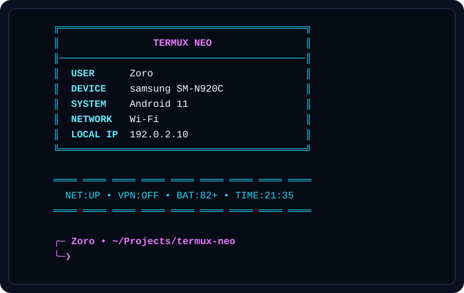
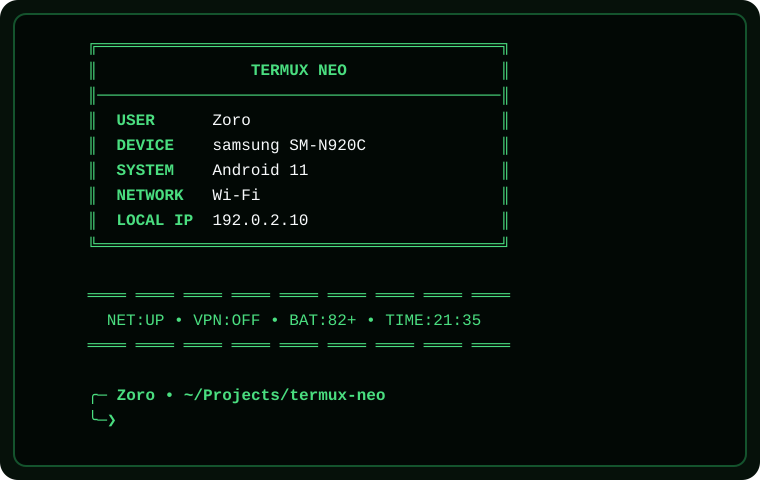

# Termux Neo

Termux Neo is a modular, render-once terminal dashboard for Termux. One command
collects bounded device state, renders Dashboard, Status, and Prompt views, and
exits. It does not require root, replace `PS1`, start a daemon, open a network
connection, or run a refresh loop.

Current release checkpoint: `0.9.0-beta`. The
[Feature Freeze](docs/feature-freeze.md) is active.

## Preview

| `neo` | `matrix` |
| --- | --- |
|  |  |

Both images are deterministic captures of the released renderer at 56 columns.
They use documentation fixture values and are not additional device evidence.
The exact evidence boundary is documented in
[Compatibility](docs/compatibility.md).

## Quick start

From a complete source tree or a verified extracted release archive:

```bash
bash install.sh
termux-neo
```

Useful commands:

```bash
termux-neo --help
termux-neo --version
termux-neo --diagnose
termux-neo --config
termux-neo --theme matrix
termux-neo --no-color
```

Only one option is accepted per invocation. `--theme` and `--no-color` are
one-run overrides and do not rewrite saved settings.

The installer writes only:

```text
$PREFIX/lib/termux-neo/
$PREFIX/bin/termux-neo
$HOME/.config/termux-neo/settings.conf
```

It preserves an existing settings file byte-for-byte. The installer never
edits `.bashrc`; optional interactive-Bash startup integration is disabled by
default and must be applied explicitly.

Read [Installation](docs/installation.md) before installing from an archive.
The checksum verifies integrity against the supplied digest but is not a
publisher signature.

## Configuration

The active settings path is:

```text
$HOME/.config/termux-neo/settings.conf
```

A schema-v1 file contains plain data, not shell code:

```ini
schema_version=1
display_user=Zoro
theme=neo
color_mode=auto
startup_integration=false
```

The only built-in themes are `neo` and `matrix`. To enable the optional Bash
startup hook, set `startup_integration=true`, save the file, and then run:

```bash
termux-neo --startup
```

See [Configuration](docs/configuration.md) and
[Themes](docs/themes.md) for the complete validated contract.

## Evidence and support boundary

The physical reference record is one Samsung Galaxy Note5 (`SM-N920C`) running
Android `11`, with terminal widths `56` and `94`. Widths `34`, `56`, and `94`
also pass deterministic portable fixtures; that fixture coverage is not a
claim about additional devices, Android releases, or Termux distribution
channels. Only interactive Bash startup through `~/.bashrc` is verified.

See [Compatibility](docs/compatibility.md) and
[Known limitations](docs/known-limitations.md) before treating a portable
test result as device support.

Canonical checkpoint references:
[docs/beta-testing.md](docs/beta-testing.md) and
[docs/security.md](docs/security.md).

## Documentation

| Topic | Reference |
| --- | --- |
| Purpose and product boundaries | [Project overview](docs/project-overview.md) |
| Supported and unverified environments | [Compatibility](docs/compatibility.md) |
| Install | [Installation](docs/installation.md) |
| Update and migration | [Update](docs/update.md) |
| Safe removal | [Uninstallation](docs/uninstallation.md) |
| Settings schema and examples | [Configuration](docs/configuration.md) |
| Authoritative schema-v1 parser contract | [Settings Schema v1](docs/settings-schema-v1.md) |
| Theme and color behavior | [Themes](docs/themes.md) |
| Commands and exit statuses | [CLI](docs/cli.md) |
| Diagnostic fields and privacy | [Diagnostics](docs/diagnostics.md) |
| Common failures | [Troubleshooting](docs/troubleshooting.md) |
| Runtime and lifecycle design | [Architecture](docs/architecture.md) |
| Local tests and release checks | [Development](docs/development.md) |
| Contribution workflow | [Contributing](docs/contributing.md) |
| Private vulnerability reporting | [Security policy](docs/security-policy.md) |
| Reviewed trust boundaries | [Security review](docs/security.md) |
| Current constraints | [Known limitations](docs/known-limitations.md) |
| Verified milestones | [Changelog](docs/changelog.md) |
| Semantic Versioning and release identity | [Versioning](docs/versioning.md) |
| Current verified release notes | [0.9.0-beta release notes](docs/releases/0.9.0-beta.md) |
| Artifact creation and verification | [Release artifacts](docs/release-artifacts.md) |
| Canonical quality pipeline | [Quality](docs/quality.md) |
| Performance and stability | [Performance](docs/performance.md) |
| Measured reference-device values | [Performance baseline](docs/performance-baseline.md) |
| Public-beta field workflow | [Beta testing](docs/beta-testing.md) |
| Recorded physical beta evidence | [Beta field report](docs/beta-field-report.md) |
| Release-gating defect ledger | [Beta issue ledger](docs/beta-issues.md) |
| Active release rules | [Feature Freeze](docs/feature-freeze.md) |

## Development

The canonical local and CI gate is:

```bash
bash scripts/quality-check.sh
```

It runs syntax/static checks and all 26 assigned test files, including the
documentation, release-discipline, clean-checkout, and extracted-artifact
regressions. Portable CI does not replace physical device evidence.

## License

Termux Neo is open-source software released under the
[MIT License](LICENSE).
